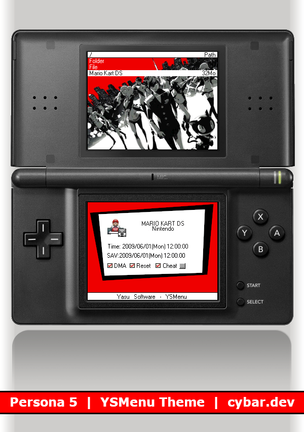

# YSMenu Persona 5

A Persona 5 theme for YSMenu for DS flashcards

---

## Installation

Place the files from the TTMenu directory of this repository into the TTMenu folder on your YSMenu flashcard.

Overwrite the existing files named `YSMenu1.bmp`, `YSMenu2.bmp`, and `YSMenu.ini` if prompted.

---

---

## Credits

- Top screen background image from [wallhere](https://get.wallhere.com/photo/Phantom-Thieves-Persona-series-Persona-5-Protagonist-Persona-5-1149834.jpg) found using [Google Images](https://images.google.com/)
- Bottom screen creation and all other image manipulation done using [GIMP](https://www.gimp.org/)
- Guided by the [YSMenu wiki on GBAtemp](https://wiki.gbatemp.net/wiki/YSMenu)
- Colours converted using [this tool](https://www.conradshome.com/html2bgr15/)
- Mockup taken from [Simple Orange YSMenu Skin](https://www.deviantart.com/shaolinassassin/art/Simple-Orange-YSMenu-Skin-146031632) by [ShaolinAssassin](https://www.deviantart.com/shaolinassassin) on [DeviantArt](https://www.deviantart.com/)
